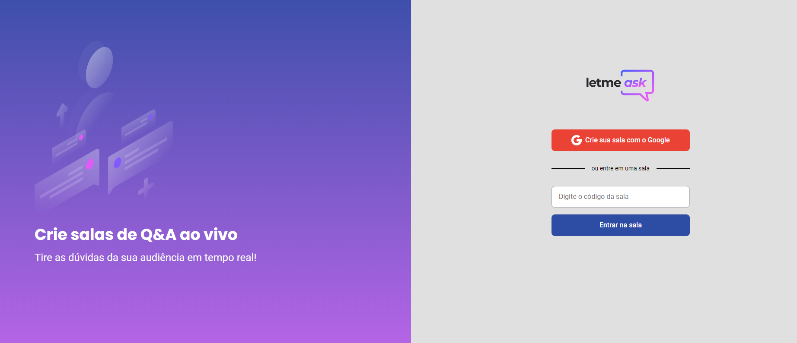

# Letmeask

<p>Aplicação desenvolvida em React, utilizando banco de dados do Firebase como integração back-end.</p>

<p>Projeto codado durante o NLW#6 da Rocketseat, com alterações próprias.</p>

<p>Tecnologias utilizadas: HTML, CSS/SASS, TypeScript, React.Js, Firebase. </p>
 
<h2>Como usar?<<div align="center" id="top"> 
  

  &#xa0;

<a href="https://letmeask-9935e.web.app/">Demo</a>
</div>

<p align="center">
  <a href="#dart-sobre">Sobre</a> &#xa0; | &#xa0; 
  <a href="#sparkles-funcionalidades">Funcionalidades</a> &#xa0; | &#xa0;
  <a href="#rocket-tecnologias">Tecnologias</a> &#xa0; | &#xa0;
  <a href="#white_check_mark-pré-requesitos">Pré requisitos</a> &#xa0; | &#xa0;
  <a href="#checkered_flag-começando">Começando</a> &#xa0; | &#xa0;
  <a href="#memo-licença">Licença</a> &#xa0; | &#xa0;
  <a href="https://github.com/gabimesquita" target="_blank">Autor</a>
</p>

<br>

## :dart: Sobre ##

Letmeask é uma plataforma de perguntas que pode ser usada para auxiliar criadores de conteúdo, a sanar dúvidas do seu público.
Este app tambem permite que o usuário o instale em seu celular - Progressive Web App (PWA)

## :sparkles: Funcionalidades ##

:heavy_check_mark: Criar sala de perguntas;
:heavy_check_mark: Criar perguntas;
:heavy_check_mark: Curtir perguntas;
:heavy_check_mark: Modo administrador;
:heavy_check_mark: Apagar perguntas - Modo administrador;
:heavy_check_mark: Destacar perguntas - Modo administrador;
:heavy_check_mark: Marcar perguntas como respondida - Modo administrador;
:heavy_check_mark: Fechar sala - Modo administrador;

## :rocket: Tecnologias ##

As seguintes ferramentas foram usadas na construção do projeto:

- [React](https://pt-br.reactjs.org/)
- [TypeScript](https://www.typescriptlang.org/)

## :white_check_mark: Pré requisitos ##

Antes de começar :checkered_flag:, você precisa ter o [Git](https://git-scm.com) e o [Node](https://nodejs.org/en/) instalados em sua maquina.

## :checkered_flag: Começando ##

```bash
# Clone este repositório
$ git clone https://github.com/gabimesquita/letmeask

# Entre na pasta
$ cd letmeask

# Instale as dependências
$ yarn

# Para iniciar o projeto
$ yarn start

# O app vai inicializar em <http://localhost:3000>
```

## :memo: Licença ##

Este projeto está sob licença MIT. Veja o arquivo [LICENSE](LICENSE.md) para mais detalhes.


&#xa0;

<a href="#top">Voltar para o topo</a>
